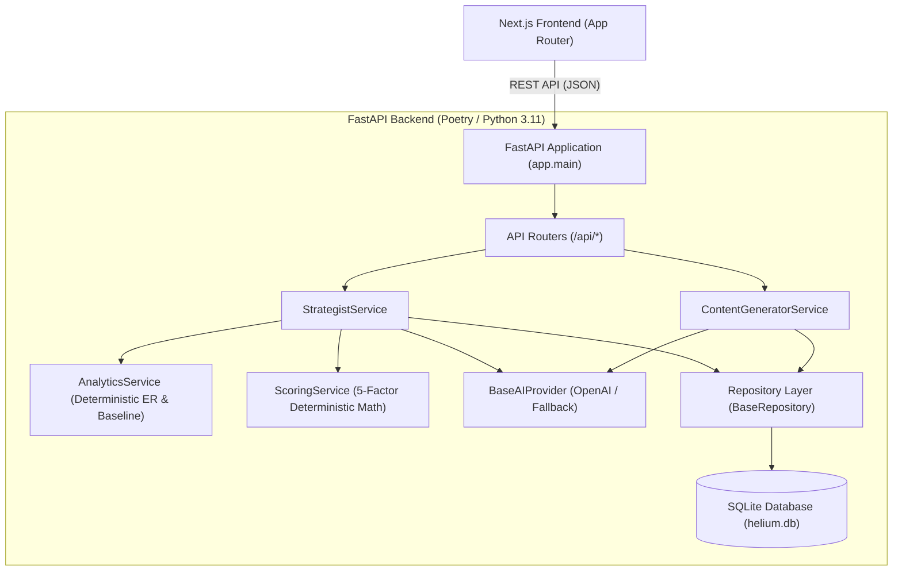

# Technical Architecture: Helium Content Copilot

## Overview

Helium Content Copilot is an AI-native decision and generation tool for D2C brands.
The system is built on a clean, decoupled architecture:
- **Backend:** Python 3.11+ / FastAPI / SQLite (`aiosqlite`) / Poetry / Pydantic v2
- **Frontend:** Next.js 16 (App Router) / TypeScript / Vanilla CSS + Tailwind tokens / Lucide Icons
- **AI Layer:** OpenAI Chat Completions API (`gpt-4o-mini`) with seamless fallback to deterministic demo data.

---
## Architectural Principles & Separation of Concerns

1. **Separation of Reasoning and Arithmetic:**
   - The LLM is used **strictly for qualitative strategy & creative copy generation** (e.g. identifying angles, writing captions and slides).
   - The LLM **never produces or calculates numeric scores**.
   - All scoring ($S_{\text{total}} = S_{\text{historical}} + S_{\text{product}} + S_{\text{audience}} + S_{\text{seasonal}} + S_{\text{objective}}$) is computed deterministically in pure Python by `ScoringService`.

2. **Repository Pattern with Async SQLite:**
   - Single persistent SQLite database (`helium.db`) initialized via `aiosqlite`.
   - Clear repository layer (`BaseRepository[T]` with specialized implementations: `BrandRepository`, `ProductRepository`, `PostRepository`, `OpportunityRepository`, `ContentRepository`, `CalendarRepository`).
   - Ensures data persistence across restarts without heavy ORM overhead.

3. **Provider Pattern for AI Integration:**
   - `BaseAIProvider` defines the abstract interface.
   - `OpenAIProvider` implements live LLM requests using strict JSON mode schemas.
   - `FallbackAIProvider` guarantees 100% functionality and reproducible demo outcomes even without an internet connection or OpenAI API key.

---
## System Architecture Diagram



---
## Backend Directory Structure

```text
backend/
├── app/
│   ├── api/
│   │   ├── __init__.py
│   │   └── routes.py              # REST endpoints (CRUD, /analyze, /generate)
│   ├── core/
│   │   ├── __init__.py
│   │   ├── config.py              # Pydantic BaseSettings (.env loading)
│   │   ├── database.py            # Async SQLite connection and DDL setup
│   │   └── logging_config.py      # Structured console logging
│   ├── data/
│   │   ├── __init__.py
│   │   └── seed_data.py           # SNITCH-inspired synthetic dataset (8 products, 25 posts)
│   ├── models/
│   │   ├── __init__.py
│   │   └── schemas.py             # Pydantic schemas, enums, & I/O definitions
│   ├── services/
│   │   ├── __init__.py
│   │   ├── ai/
│   │   │   ├── __init__.py
│   │   │   ├── fallback_data.py   # Deterministic fallback responses
│   │   │   ├── prompts.py         # CO-STAR formatted prompts
│   │   │   └── providers.py       # OpenAIProvider & FallbackAIProvider
│   │   ├── analytics.py           # Pure Python ER computations
│   │   ├── content_generator.py   # Content creation, editing, approval, scheduling
│   │   ├── repositories.py        # Generic BaseRepository & entity repositories
│   │   ├── scoring.py             # Deterministic 5-factor scoring engine
│   │   └── strategist.py          # Opportunity pipeline orchestration
│   └── main.py                    # Lifespan startup, CORS & FastAPI initialization
├── tests/
│   ├── __init__.py
│   ├── test_analytics.py          # ER arithmetic & aggregation unit tests
│   ├── test_schemas_and_fallback.py # Pydantic schema validation tests
│   └── test_scoring.py            # Scoring formula & ranking unit tests
├── pyproject.toml                 # Poetry dependencies & config
└── .env.example                   # Environment configuration template
```

---
## Linear User Workflow

The application is structured around a single, cohesive workflow:

```text
Dashboard (Metrics & Health)
    │
    ▼ [ Find Content Opportunities ]
Opportunity Detail ("Why this recommendation?" Hero screen with 92/100 score)
    │
    ▼ [ Generate Content ]
Content Studio (Interactive Instagram Preview, Copy Editing, Approval)
    │
    ▼ [ Schedule Post ]
Calendar View (Visual publication timeline)
```
