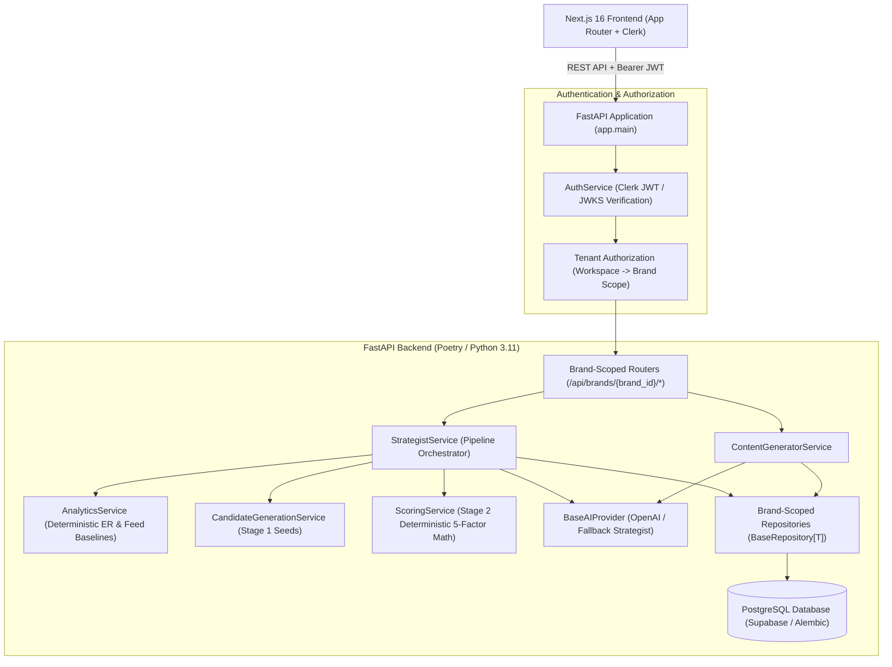

# Technical Architecture: BrandBrew — Marketing Intelligence Platform

## 1. System Overview

**BrandBrew** is an AI-powered D2C marketing intelligence and content decision platform designed to answer the core strategic question for modern ecommerce brands:
> **"What content should this brand create next — and why?"**

The system is built on a clean, production-oriented decoupled SaaS architecture:
- **Backend:** Python 3.11+ / FastAPI / SQLAlchemy / Alembic / asyncpg / aiosqlite / Poetry / Pydantic v2
- **Database:** PostgreSQL (Supabase) in production / SQLite for local unit testing
- **Authentication & Tenancy:** Clerk JWT authentication, JWKS cryptographic key caching, and multi-tenant brand isolation
- **Frontend:** Next.js 16 (App Router) / TypeScript / Vanilla CSS tokens / Lucide Icons / Clerk React SDK
- **AI Layer:** OpenAI Chat Completions API with structured schemas and reproducible fallback providers

---

## 2. Core Architectural Principles

1. **"Deterministic Math for Truth, AI for Strategic Language"**:
   - The LLM is used **strictly for qualitative strategy & creative copywriting** (identifying unique angles, narrative slide scripts, and reasoning).
   - The LLM **never produces or calculates numeric scores, revenue metrics, or engagement rates**.
   - All scoring ($S_{\text{total}} = S_{\text{historical}} + S_{\text{product}} + S_{\text{audience}} + S_{\text{seasonal}} + S_{\text{objective}}$) is computed deterministically in pure Python by `ScoringService`.

2. **Two-Stage Recommendation Pipeline**:
   - **Stage 1 — Candidate Generation (`CandidateGenerationService`)**: Generates a bounded set of candidate opportunities by combining catalog products, historical format performance, and active campaign objectives.
   - **Stage 2 — Deterministic Scoring (`ScoringService`)**: Computes the 5-factor mathematical score ($0–100$) and confidence indicators for candidates.
   - **Stage 3 — AI Strategic Enrichment (`BaseAIProvider`)**: Generates actionable creative angles, hooks, and strategic why rationale.

3. **Persistent Opportunity Storage**:
   - Ranked recommendations are persisted to PostgreSQL (`opportunities` table with `brand_id` and `analysis_run_id`).
   - The dashboard reads directly from the database ($<50\text{ ms}$ response time), decoupling UI latency from external LLM execution.

4. **Multi-Tenant Brand Scoping & Authorization**:
   - Multi-brand workspace support out of the box (e.g. **SNITCH**, **BLISSCLUB**, **THE SOULED STORE**).
   - Every domain entity (`products`, `historical_posts`, `opportunities`, `content_drafts`, `calendar_entries`) contains an explicit `brand_id` column.
   - Repositories and API routes strictly enforce brand isolation (`WHERE brand_id = :brand_id`).

5. **Database Migrations with Alembic**:
   - Schema evolutions and indexes are tracked version-by-version in `backend/alembic/versions/`.

---

## 3. System Architecture Diagram



---

## 4. Multi-Tenant Database Schema

```mermaid
erDiagram
    BRANDS ||--o{ PRODUCTS : owns
    BRANDS ||--o{ HISTORICAL_POSTS : has
    BRANDS ||--o{ OPPORTUNITIES : receives
    BRANDS ||--o{ CONTENT_DRAFTS : creates
    BRANDS ||--o{ CALENDAR_ENTRIES : schedules
    USERS ||--o{ BRANDS : accesses

    BRANDS {
        string id PK
        string workspace_id FK
        string name
        string description
        json tone
        json audience
        string campaign
        datetime created_at
    }

    PRODUCTS {
        string id PK
        string brand_id FK
        string name
        string category
        int price_inr
        text description
        json features
        string season
        string target_audience
        string inventory_status
        int views
        int sales
    }

    HISTORICAL_POSTS {
        string id PK
        string brand_id FK
        string platform
        string format
        text caption
        string product_id FK
        string category
        string audience
        string objective
        date posted_date
        int impressions
        int likes
        int comments
        int shares
        int saves
        int clicks
        int conversions
    }

    OPPORTUNITIES {
        string id PK
        string brand_id FK
        string analysis_run_id
        string title
        text content_angle
        string audience
        string objective
        string platform
        string format
        string suggested_product_id FK
        text why
        int score
        json score_breakdown
        string confidence
        text confidence_reason
        datetime created_at
    }
```



---

## 5. Directory Structure

```text
Helium/
├── backend/
│   ├── alembic/
│   │   ├── versions/
│   │   │   └── 001_initial_multitenant_schema.py
│   │   └── env.py
│   ├── alembic.ini
│   ├── app/
│   │   ├── api/
│   │   │   └── routes.py              # Brand-scoped REST endpoints
│   │   ├── core/
│   │   │   ├── config.py              # Pydantic Settings (.env configuration)
│   │   │   ├── database.py            # Multi-tenant tables & connection pool
│   │   │   └── logging_config.py      # Structured logging
│   │   ├── data/
│   │   │   └── seed_data.py           # Multi-brand synthetic datasets (SNITCH, BLISSCLUB, SOULED STORE)
│   │   ├── models/
│   │   │   └── schemas.py             # Domain models, CandidateOpportunity, Pydantic schemas
│   │   ├── services/
│   │   │   ├── ai/                    # OpenAI & Fallback providers
│   │   │   ├── analytics.py           # Deterministic aggregation math
│   │   │   ├── auth_service.py        # Clerk JWT verification & brand tenant authorization
│   │   │   ├── candidate_generator.py # Stage 1 Candidate Generation Service
│   │   │   ├── content_generator.py   # Carousel/Reel script generator
│   │   │   ├── repositories.py        # Brand-scoped repository layer
│   │   │   ├── scoring.py             # Stage 2 Deterministic 5-factor scoring engine
│   │   │   └── strategist.py          # 2-stage opportunity pipeline orchestrator
│   │   └── main.py                    # Lifespan startup, CORS & FastAPI initialization
│   ├── tests/
│   │   ├── test_analytics.py          # Engagement rate math tests
│   │   ├── test_auth.py               # Clerk token verification tests
│   │   ├── test_candidate_generator.py# Candidate bounds & heuristic tests
│   │   ├── test_scoring.py            # Deterministic scoring formula tests
│   │   ├── test_tenant_isolation.py   # Multi-tenant authorization & scoping tests
│   │   └── test_validator.py          # Pydantic schema validation tests
│   └── pyproject.toml
├── frontend/
│   ├── src/
│   │   ├── app/
│   │   │   ├── layout.tsx
│   │   │   └── page.tsx               # Multi-brand dashboard with instant data loading
│   │   ├── components/
│   │   │   ├── Sidebar.tsx            # Brand workspace switcher dropdown
│   │   │   ├── Dashboard.tsx          # Ranked opportunities feed & benchmarks
│   │   │   ├── OpportunityDetail.tsx  # Score breakdown & strategic signals
│   │   │   ├── ContentStudio.tsx      # Reel/Carousel slide editor & scheduler
│   │   │   ├── CalendarView.tsx       # Drag & drop editorial schedule
│   │   │   └── BrandView.tsx          # Catalog & guidelines management
│   │   ├── lib/
│   │   │   ├── api.ts                 # Brand-scoped API client
│   │   │   └── types.ts               # TypeScript domain interfaces
│   │   └── middleware.ts              # Clerk route protection proxy
│   └── package.json
└── docs/
    ├── ARCHITECTURE.md
    └── FUTURE_SCOPE_ROADMAP.md        # Distributed scaling roadmap (Kafka, Celery, pgvector)
```
